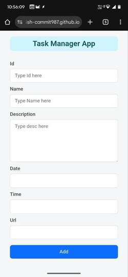

# 📝 Task Manager Web App

A clean, modern, feature-rich **To-Do & Task Manager Web App** built using vanilla JavaScript, HTML5, CSS3, and Bootstrap — with advanced functionalities like **calendar-based scheduling**, **AutoRemote integration**, **local storage saving**, and a **responsive animated UI**.

A clean, modern, feature-rich To-Do & Task Manager Web App built using only JavaScript — no frameworks, no libraries.

🧠 Even the HTML structure is dynamically created with JavaScript, making this a fully JS-driven application from logic to UI.

## Screenshot

### 🏠 Home Page

### ➕ Add Task Preview

## 🚀 Features

### ✅ Add, Edit & Delete Tasks
- Add tasks with:
  - Unique **ID**
  - **Name**
  - **Description**
  - **Date** and **Time**
  - Optional **Image URL**
- Edit existing tasks with inline form binding.
- Mark tasks for deletion (soft delete), and batch delete them using the "Delete" button.

### 🗓️ Smart Date & Time Integration
- Choose a specific **date and time** for each task.
- Automatically generates a **UNIX timestamp** to represent the scheduled time.
- Designed for integrations with calendar-based or automation tools.

### 📡 AutoRemote Integration (Task Automation)
- On clicking **"Save"**, each task with a valid time sends a message to **AutoRemote** with:
  - Timestamp
  - Task name
  - Description
- Can be used to:
  - Trigger task reminders
  - Automate notifications on your Android phone

### 💾 Local Storage Support
- Saves all your tasks to your browser’s **local storage** using `localStorage`.
- Can load previously saved tasks anytime.
- Great for offline use — no database needed!

### 🌐 Load from Server (Optional)
- Supports fetching tasks from a static JSON file (`tasks.json`) on your local development server.
- Great for demo purposes or mock APIs.

### 💡 Smart UI & UX Features
- Live counters:
  - ✅ **Total Tasks**
  - ❌ **Marked for Deletion**
  - ✏️ **Remaining Tasks**
- Live photo previews for tasks (if image URL is added).
- Responsive layout for mobile and tablet screens.
- Animated button and click effects.

---

## 🌈 Modern UI Design

- Built with Bootstrap 5
- Custom CSS for:
  - Animated buttons
  - Icon-based editing and deleting
  - Responsive design
---

🔐 AutoRemote Key Configuration
To make AutoRemote integration work:

Get your AutoRemote key from: https://joaoapps.com/autoremote/

Replace the key= inside the sendToAutoRemote() function with your own key.

That’s it! Now tasks will trigger remote messages when saved.

.

🛠️ Future Enhancements (Optional Ideas)

 Add reminders using Push Notifications

 Export/import tasks as .json or .csv

 Drag-and-drop task reordering

 
 ## ❤️ Author
 
Made with care by Ashish Singh
